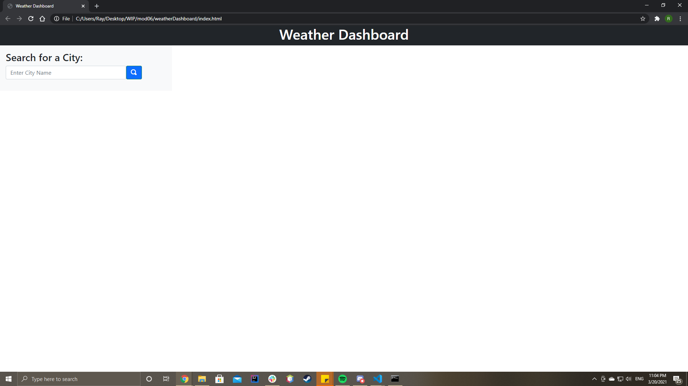
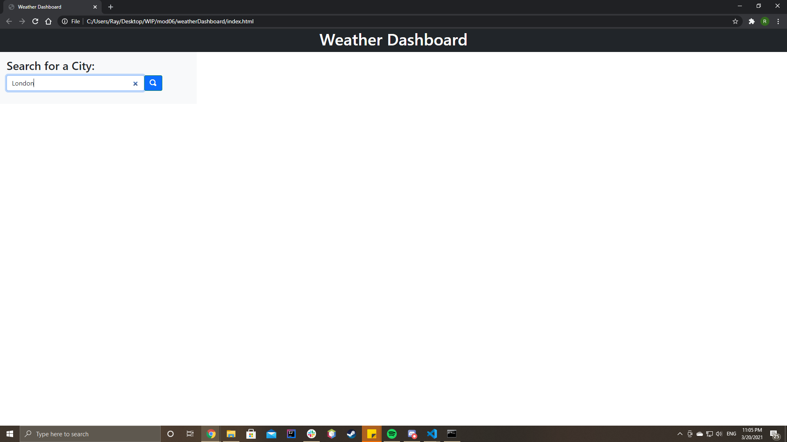
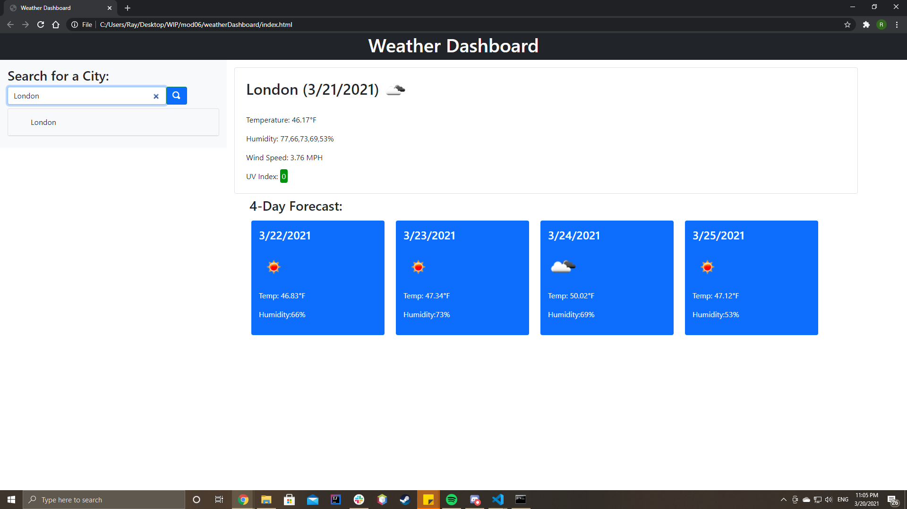
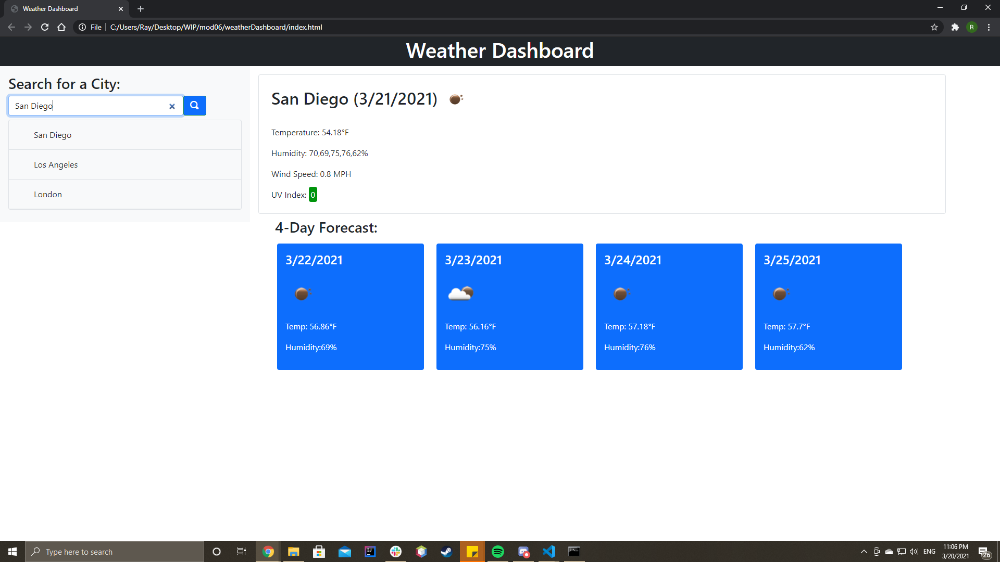

# weatherDashboard

## Purpose
To create a website that allows travelers to check the weather of a city. This website can display 5 days worth of weather data.

## Demo

## Built With
* HTML
* CSS
* JavaScript
* Third party API (Bootstrap, jQuery, moment.js)
* Server side API (OpenWeatherMap)

## Website

## Contribution
Ray Takemura

&copy; Ray Takemura
